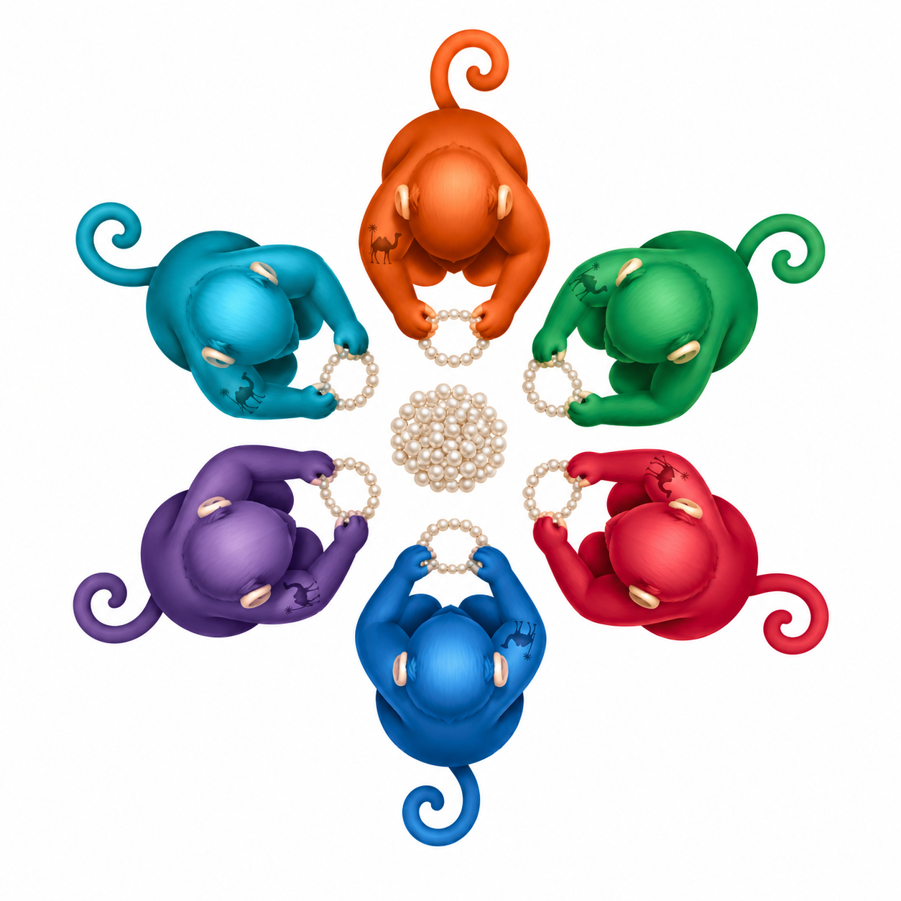

<p align="center">
  
</p>

<h1 align="center">munki-perls</h1>

<p align="center">
  <strong>Typed Munki perls for Macs from Leopard onward.</strong><br>
  Drop-in plugins, native plist values, and no additional runtime to explain.
</p>

<p align="center">
  <a href="https://github.com/weswhet/munki-perls/actions/workflows/test.yml"></a>
  <a href="https://github.com/weswhet/munki-perls/releases/latest"></a>
  <a href="LICENSE.md"></a>
</p>

> A condition should be interesting to the manifest and profoundly boring to
> the machine.

When a Mac checks in, Munki already knows quite a lot. The difficult question
is usually the one perl it does not know: whether FileVault is on, which user
owns the console, whether the hardware can take the next macOS upgrade, or
what sort of virtual machine has appeared in inventory this morning.

[`munki-facts`](https://github.com/munki/munki-facts) established a useful
vocabulary for those answers. `munki-perls` carries that vocabulary forward as
a Perl 5.8.8-compatible collection of Munki
[admin-provided conditions](https://github.com/munki/munki/wiki/Conditional-Items),
using only the `Foundation` and `PerlObjCBridge` modules Apple shipped with OS X.
It provisionally supports fully patched Mac OS X 10.5.8 Leopard on Intel and
PowerPC, plus later OS X and macOS releases on the architectures they support,
without installing Python, a package manager, or a small ecosystem in order to
write one property list. Leopard installation and full runtime smoke testing
remain pending; see
[Testing](#testing) for the validation boundary.

The result is deliberately plain: native plist values, serialized updates, a
strict subprocess allowlist for bundled collectors, and perls that keep their
historical names and semantics. Inventory should be informative. Its
implementation need not be an event.

## At a glance

| | |
| --- | --- |
| **Compatibility** | Provisionally Mac OS X 10.5.8 on Intel and PowerPC, plus later releases; Perl 5.8.8 |
| **Contract** | Drop-in `perls()` plugins returning typed key/value maps |
| **Output** | Munki's configured `ManagedInstallDir/ConditionalItems.plist` |
| **Dependencies** | Apple's stock Perl, `Foundation`, and `PerlObjCBridge` |
| **Writes** | Sidecar-locked and atomically replaced through Foundation |
| **Distribution** | Unsigned `.pkg` from each successful `main` release |

## What it knows

The perls fall into four families. They share one writer and one contract, so
adding an answer does not create a new dialect of “true.”

| Family | Answers |
| --- | --- |
| **People and sessions** | admin users, console user and login state, local home directories, CrashPlan username |
| **Security and management** | FileVault, Gatekeeper, SIP, Back to My Mac, managed user, enabled system extensions |
| **Hardware** | physical or virtual, virtual-machine vendor |
| **Upgrade paths** | Sierra through Goldengate, evaluated against OS version and Apple hardware identifiers |

### Bundled perl contract

One executable runner discovers the non-executable `.pl` files in its sibling
`perls` directory. Each plugin defines `perls()`, returns one or more typed
keys, and needs no plist-writing or command-line scaffolding. The bundled
plugins provide the following keys and native plist types.

| Key | Native plist type |
| --- | --- |
| `admin_users` | array of strings |
| `backtomymac_configured` | boolean |
| `bigsur_upgrade_supported` | boolean |
| `catalina_upgrade_supported` | boolean |
| `console_user` | string |
| `console_user_logged_in` | boolean |
| `crashplan_username` | string |
| `filevault_status` | string |
| `gatekeeper_status` | string |
| `goldengate_upgrade_supported` | boolean |
| `local_user_dirs` | array of strings |
| `machine_type` | string: `physical`, `vmware`, `virtualbox`, `parallels`, or `unknown_virtual` |
| `mdm_managed_user` | string |
| `mojave_upgrade_supported` | boolean |
| `monterey_upgrade_supported` | boolean |
| `physical_or_virtual` | string: `physical` or `virtual` |
| `sequoia_upgrade_supported` | boolean |
| `sierra_upgrade_supported` | boolean |
| `sip_status` | string |
| `sonoma_upgrade_supported` | boolean |
| `system_extensions` | array of currently enabled system-extension bundle identifiers |
| `tahoe_upgrade_supported` | boolean |
| `ventura_upgrade_supported` | boolean |

`machine_type` intentionally replaces Munki's built-in `laptop`/`desktop`
value. That historical collision is part of the contract, now with the courtesy
of documentation. `physical_or_virtual` retains its simpler two-value domain.

`system_extensions` reads Apple's system-extension database and includes only
records in the `activated_enabled` state. It is a current usability inventory,
not a record of whether a user or an MDM policy originally approved an
extension.

The included collection stays focused on broadly useful inventory and
compatibility answers. Site-specific and community additions can be dropped
in without changing the runner or a registration manifest.

## Installation

Download the current package from
[GitHub Releases](https://github.com/weswhet/munki-perls/releases/latest), then
install it at the system volume:

```sh
sudo /usr/sbin/installer -pkg munki-perls-0.1.N.pkg -target /
```

The package installs one executable runner, its shared modules, and the bundled
non-executable plugins at `/usr/local/munki/conditions`.

To install directly from a checkout, first remove the retired bundled
executables from older releases, then preserve modes while copying the new
layout:

```sh
sudo tools/pkg-scripts/postinstall
sudo /bin/mkdir -p /usr/local/munki/conditions
sudo /usr/bin/ditto conditions /usr/local/munki/conditions
```

The cleanup script names only files previously owned by this project. It does
not remove unrelated top-level conditions or custom plugins. Package upgrades
run the same cleanup automatically.

Munki executes `munki_perls.pl` and ignores the `perls` directory. The runner
loads every valid plugin and writes their combined output to the configured
`ManagedInstallDir/ConditionalItems.plist` once.

## Using the conditions

The runner accepts `--output PATH`, `--only NAME`, `--verbose`, and `--help`.
Use `--only` with an output override to test one plugin without involving the
production plist:

```sh
/usr/local/munki/conditions/munki_perls.pl \
  --only ventura_upgrade_supported \
  --output /tmp/ConditionalItems.plist \
  --verbose
```

Set `MUNKI_PERLS_DEBUG=1` for the same concise diagnostics as `--verbose`.
Runner diagnostics identify the plugin and failure stage without printing its
returned values. Plugin authors should likewise keep sensitive values out of
exceptions. Missing commands on older systems yield the established `Unknown`
or `NONE` fallback and allow the remaining plugins to continue with their day.

## Adding a plugin

A plugin is an ordinary, non-executable Perl file with a `perls()` function.
It may return one key or a related group of keys:

```perl
use 5.008008;
use strict;
use warnings;
use MunkiPerls qw(
    perl_array perl_bool perl_dictionary perl_integer perl_real perl_string
);

sub perls {
    return {
        office_name => perl_string('West'),
        office_floor => perl_integer(4),
        office_features => perl_array('studio', 'kitchen'),
        office_details => perl_dictionary(
            open => perl_bool(1),
            capacity_ratio => perl_real('0.75'),
        ),
    };
}

1;
```

Install it as trusted root code. The runner rejects symlinks, files with the
wrong owner, and files or directories writable by group or others:

```sh
sudo /usr/bin/install -o root -g wheel -m 0644 \
  office.pl /usr/local/munki/conditions/perls/office.pl
```

Plugins are loaded in sorted filename order and isolated namespaces. A broken
plugin is diagnosed and skipped without losing valid results from the others.
When plugins return the same key, the later filename wins; verbose mode reports
the replacement. Prefix an intentional site override accordingly, for example
`zz_site_machine_type.pl`.

Values use explicit constructors so plist booleans and numbers do not become
ambiguous Perl scalars. Arrays and dictionaries may be nested recursively;
bare scalar members are treated as strings.

## Upgrade compatibility

Each upgrade plugin emits one boolean perl. The upgrade plugins share a
reboot-scoped hardware snapshot and evaluate their named result in the same
order:

1. A Mac already at or above the target is not eligible.
2. A Mac below the release's minimum source version is not eligible.
3. An eligible virtual machine is supported.
4. A physical Mac must match the release's model, board, or hardware-target
   tables.

| Perl | Target | Eligible source versions |
| --- | ---: | --- |
| `sierra_upgrade_supported` | 10.12 | 10.7–10.11 |
| `mojave_upgrade_supported` | 10.14 | 10.7–10.13 |
| `catalina_upgrade_supported` | 10.15 | 10.9–10.14 |
| `bigsur_upgrade_supported` | 11 | 10.7 through the release below 11 |
| `monterey_upgrade_supported` | 12 | 10.7 through the release below 12 |
| `ventura_upgrade_supported` | 13 | 10.7 through the release below 13 |
| `sonoma_upgrade_supported` | 14 | 10.7 through the release below 14 |
| `sequoia_upgrade_supported` | 15 | 10.7 through the release below 15 |
| `tahoe_upgrade_supported` | 26 | 10.7 through the release below 26 |
| `goldengate_upgrade_supported` | 27 | 10.7 through the release below 27 |

Leopard runtime support does not change upgrade eligibility. These perls retain
their existing minimum source versions: 10.7 for every row shown as 10.7 and
10.9 for Catalina.

Sierra uses the final model and board tables from the parent of
[`munki-facts` removal commit `bbeee28dd2a5`](https://github.com/munki/munki-facts/commit/bbeee28dd2a5).
The remaining hardware tables continue the lineage at
[`a22a02a0304a`](https://github.com/munki/munki-facts/commit/a22a02a0304a).

## How it stays boring

- Property lists are read, constructed, typed, and serialized with Foundation.
- Booleans and numbers retain native plist types; arrays and dictionaries may
  contain recursively typed values.
- Plugins are discovered deterministically, validated independently, and
  collected before writing.
- A stable sidecar lock serializes updates with other Munki conditions.
- Foundation atomically replaces the destination, so a partial file does not
  become tomorrow's inventory puzzle.
- Upgrade and virtualization conditions share a hardware-only snapshot at
  `<output>.munki-perls-hardware-cache.plist`. Its schema and `kern.boottime`
  identifier keep it valid only for the current boot. A malformed or stale
  cache—or any lock or write failure—falls back to live collection and never
  prevents a perl from being written.
- Bundled subprocesses use allowlisted absolute paths and direct argument
  vectors. The shell is not invited; it tends to bring interpretation with it.
- Virtual hardware is detected from the shared snapshot. Only the
  `machine_type.pl` plugin makes the vendor-specific `system_profiler` query,
  and only for virtual Macs, to distinguish VMware, VirtualBox, Parallels, and
  the entirely respectable `unknown_virtual`.

Back to My Mac is queried through `scutil` only on Mojave and older and is
always false on Catalina and newer, which settled that question rather neatly.

## Maintainer tools

`tools/extract_supported_devices.pl` reads an installer asset plist with
Foundation, validates and deduplicates `SupportedDeviceModels`, and prints a
sorted Perl `qw(...)` table.

`tools/build-pkg.pl` stages the payload with native Perl file APIs and invokes
only `/usr/bin/pkgbuild`. The tool is Perl 5.8.8-compatible, but packages must
be built on a newer host that provides `pkgbuild`; Leopard is a supported
installation target, not a package build host. It creates an unsigned package with identifier
`com.github.weswhet.munki-perls`, installed at
`/usr/local/munki/conditions`:

```sh
tools/build-pkg.pl --verbose
tools/build-pkg.pl --version 0.1.42 --output /tmp/munki-perls-0.1.42.pkg
```

After both CI architectures pass, every push to `main` uses the workflow run
number to build version `0.1.N`, creates tag `v0.1.N`, and publishes the package
on a GitHub Release. Re-running the workflow replaces the existing asset rather
than attempting to improve arithmetic.

## Testing

Run the syntax and test suites with Apple's Perl:

```sh
find conditions tools t -type f \
  \( -name '*.pl' -o -name '*.pm' -o -name '*.t' \
    -o -name postinstall \) \
  -exec /usr/bin/perl -Iconditions/lib -c {} \;
/usr/bin/prove -lr t
```

CI covers every standard GitHub-hosted macOS image: ARM on `macos-14`,
`macos-15`, and `macos-26`, plus Intel on `macos-15-intel` and
`macos-26-intel`. Injected OS, hardware, and Foundation plist fixtures exercise
earlier macOS and virtual-machine branches. A checksum-pinned build of exact
Perl 5.8.8 compiles every Perl source and test with a compile-only Foundation
stub, then runs the Foundation-independent syntax, policy, and package tests
on every image.
The modern-Perl suite also builds and expands a package, inspects its BOM, and
verifies the complete native plist contract. Package tests skip on hosts
without `/usr/bin/pkgbuild`.

Leopard validation is still pending. On real or virtual fully patched 10.5.8
Intel and PowerPC systems, install a package built on a `pkgbuild` host, run all
installed conditions, verify the native plist types and hardware-cache reuse,
and run the Foundation-dependent tests. Until that matrix passes, 10.5.8
support is provisional. Continue smoke-testing later releases as before. A
successful run is expected to be thoroughly boring. Here, that is a feature.

## Lineage and license

Licensed under the [Apache License 2.0](LICENSE.md). Hardware compatibility
tables and original perl behavior follow the `munki-facts` lineage described
above.
