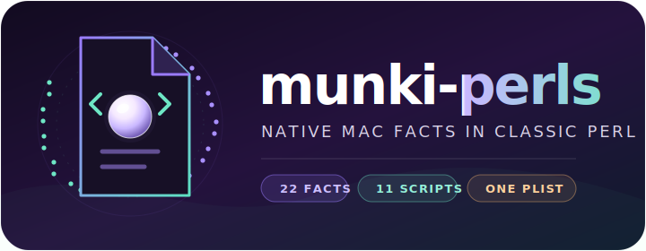

<p align="center">
  
</p>

<h1 align="center">munki-perls</h1>

<p align="center">
  <strong>Typed Munki facts for every Mac from Lion onward.</strong><br>
  Eleven quiet condition scripts, twenty-two useful answers, and no additional runtime to explain.
</p>

<p align="center">
  <a href="https://github.com/weswhet/munki-perls/actions/workflows/test.yml"></a>
  <a href="https://github.com/weswhet/munki-perls/releases/latest"></a>
  <a href="LICENSE.md"></a>
</p>

> A condition should be interesting to the manifest and profoundly boring to
> the machine.

When a Mac checks in, Munki already knows quite a lot. The difficult question
is usually the one fact it does not know: whether FileVault is on, which user
owns the console, whether the hardware can take the next macOS upgrade, or
what sort of virtual machine has appeared in inventory this morning.

[`munki-facts`](https://github.com/munki/munki-facts) established a useful
vocabulary for those answers. `munki-perls` carries that vocabulary forward as
a Perl 5.12-compatible collection of Munki
[admin-provided conditions](https://github.com/munki/munki/wiki/Conditional-Items),
using only the `Foundation` and `PerlObjCBridge` modules Apple shipped with OS X.
It supports OS X 10.7 Lion and every release after it without installing Python,
a package manager, or a small ecosystem in order to write one property list.

The result is deliberately plain: native plist values, serialized updates, a
strict subprocess allowlist, and facts that keep their historical names and
semantics. Inventory should be informative. Its implementation need not be an
event.

## At a glance

| | |
| --- | --- |
| **Compatibility** | OS X 10.7 Lion and newer; Perl 5.12 |
| **Contract** | Exactly 22 native plist keys from 11 executable scripts |
| **Output** | Munki's configured `ManagedInstallDir/ConditionalItems.plist` |
| **Dependencies** | Apple's stock Perl, `Foundation`, and `PerlObjCBridge` |
| **Writes** | Sidecar-locked and atomically replaced through Foundation |
| **Distribution** | Unsigned `.pkg` from each successful `main` release |

## What it knows

The facts fall into four families. They share one writer and one contract, so
adding an answer does not create a new dialect of “true.”

| Family | Answers |
| --- | --- |
| **People and sessions** | admin users, console user and login state, local home directories, CrashPlan username |
| **Security and management** | FileVault, Gatekeeper, SIP, Back to My Mac, managed user |
| **Hardware** | physical or virtual, virtual-machine vendor |
| **Upgrade paths** | Sierra through Goldengate, evaluated against OS version and Apple hardware identifiers |

### Fact contract

The installed scripts provide exactly these keys and native plist types:

| Key | Native plist type |
| --- | --- |
| `admin_users` | array of strings |
| `backtomymac_configured` | boolean |
| `bigsur_upgrade_supported` | boolean |
| `catalina_upgrade_supported` | boolean |
| `console_user` | string |
| `console_user_logged_in` | boolean |
| `crashplan_username` | string |
| `filevault_status` | string |
| `gatekeeper_status` | string |
| `goldengate_upgrade_supported` | boolean |
| `local_user_dirs` | array of strings |
| `machine_type` | string: `physical`, `vmware`, `virtualbox`, `parallels`, or `unknown_virtual` |
| `mdm_managed_user` | string |
| `mojave_upgrade_supported` | boolean |
| `monterey_upgrade_supported` | boolean |
| `physical_or_virtual` | string: `physical` or `virtual` |
| `sequoia_upgrade_supported` | boolean |
| `sierra_upgrade_supported` | boolean |
| `sip_status` | string |
| `sonoma_upgrade_supported` | boolean |
| `tahoe_upgrade_supported` | boolean |
| `ventura_upgrade_supported` | boolean |

`machine_type` intentionally replaces Munki's built-in `laptop`/`desktop`
value. That historical collision is part of the contract, now with the courtesy
of documentation. `physical_or_virtual` retains its simpler two-value domain.

Community facts remain unbundled for now. Twenty-two keys should keep the
property list adequately occupied.

## Installation

Download the current package from
[GitHub Releases](https://github.com/weswhet/munki-perls/releases/latest), then
install it at the system volume:

```sh
sudo /usr/sbin/installer -pkg munki-perls-0.1.N.pkg -target /
```

The package installs the 11 executable `.pl` files and their shared modules at
`/usr/local/munki/conditions`.

To install directly from a checkout instead, preserve the executable modes and
copy the contents of `conditions/` to the same path:

```sh
sudo /bin/mkdir -p /usr/local/munki/conditions
sudo /usr/bin/ditto conditions /usr/local/munki/conditions
```

Munki runs each executable and merges its facts into the configured
`ManagedInstallDir/ConditionalItems.plist`.

## Using the conditions

Every condition accepts `--output PATH`, `--verbose`, and `--help`. The output
override is useful for testing without involving the production plist:

```sh
/usr/local/munki/conditions/macos_upgrade_supported.pl \
  --output /tmp/ConditionalItems.plist \
  --verbose
```

Set `MUNKI_PERLS_DEBUG=1` for the same concise diagnostics as `--verbose`.
Diagnostics report collection and write status but never usernames or fact
values. Missing commands on older systems yield the established `Unknown` or
`NONE` fallback and allow the remaining scripts to continue with their day.

## Upgrade compatibility

The consolidated upgrade condition takes one hardware snapshot and emits ten
boolean facts. Evaluation always proceeds in the same order:

1. A Mac already at or above the target is not eligible.
2. A Mac below the release's minimum source version is not eligible.
3. An eligible virtual machine is supported.
4. A physical Mac must match the release's model, board, or hardware-target
   tables.

| Fact | Target | Eligible source versions |
| --- | ---: | --- |
| `sierra_upgrade_supported` | 10.12 | 10.7–10.11 |
| `mojave_upgrade_supported` | 10.14 | 10.7–10.13 |
| `catalina_upgrade_supported` | 10.15 | 10.9–10.14 |
| `bigsur_upgrade_supported` | 11 | 10.7 through the release below 11 |
| `monterey_upgrade_supported` | 12 | 10.7 through the release below 12 |
| `ventura_upgrade_supported` | 13 | 10.7 through the release below 13 |
| `sonoma_upgrade_supported` | 14 | 10.7 through the release below 14 |
| `sequoia_upgrade_supported` | 15 | 10.7 through the release below 15 |
| `tahoe_upgrade_supported` | 26 | 10.7 through the release below 26 |
| `goldengate_upgrade_supported` | 27 | 10.7 through the release below 27 |

Sierra uses the final model and board tables from the parent of
[`munki-facts` removal commit `bbeee28dd2a5`](https://github.com/munki/munki-facts/commit/bbeee28dd2a5).
The remaining hardware tables continue the lineage at
[`a22a02a0304a`](https://github.com/munki/munki-facts/commit/a22a02a0304a).

## How it stays boring

- Property lists are read, constructed, typed, and serialized with Foundation.
- Booleans remain plist booleans; arrays and strings remain what they claim.
- A stable sidecar lock serializes updates from independently launched scripts.
- Foundation atomically replaces the destination, so a partial file does not
  become tomorrow's inventory puzzle.
- Subprocesses use absolute paths and direct argument vectors. The shell is not
  invited; it tends to bring interpretation with it.
- Virtual hardware is detected once. Physical Macs stop there; virtual Macs use
  one `system_profiler` plist to distinguish VMware, VirtualBox, Parallels, and
  the entirely respectable `unknown_virtual`.

Back to My Mac is queried through `scutil` only on Mojave and older and is
always false on Catalina and newer, which settled that question rather neatly.

## Maintainer tools

`tools/extract_supported_devices.pl` reads an installer asset plist with
Foundation, validates and deduplicates `SupportedDeviceModels`, and prints a
sorted Perl `qw(...)` table.

`tools/build-pkg.pl` stages the payload with native Perl file APIs and invokes
only `/usr/bin/pkgbuild`. It creates an unsigned package with identifier
`com.github.weswhet.munki-perls`, installed at
`/usr/local/munki/conditions`:

```sh
tools/build-pkg.pl --verbose
tools/build-pkg.pl --version 0.1.42 --output /tmp/munki-perls-0.1.42.pkg
```

After both CI architectures pass, every push to `main` uses the workflow run
number to build version `0.1.N`, creates tag `v0.1.N`, and publishes the package
on a GitHub Release. Re-running the workflow replaces the existing asset rather
than attempting to improve arithmetic.

## Testing

Run the syntax and test suites with Apple's Perl:

```sh
find conditions tools -type f \( -name '*.pl' -o -name '*.pm' \) \
  -exec /usr/bin/perl -Iconditions/lib -c {} \;
/usr/bin/prove -lr t
```

CI covers ARM on `macos-15` and Intel on `macos-26-intel`; injected OS,
hardware, and Foundation plist fixtures exercise earlier macOS and virtual
machine branches. The suite also builds and expands a package, inspects its
BOM, and verifies the exact 22-key native plist contract.

Before a release, smoke-test the installed package on real or virtual Lion,
Mountain Lion, Mavericks, Yosemite, El Capitan, Sierra, High Sierra, and Mojave
systems. A successful run is expected to be thoroughly boring. Here, that is a
feature.

## Lineage and license

Licensed under the [Apache License 2.0](LICENSE.md). Hardware compatibility
tables and original fact behavior follow the `munki-facts` lineage described
above.
